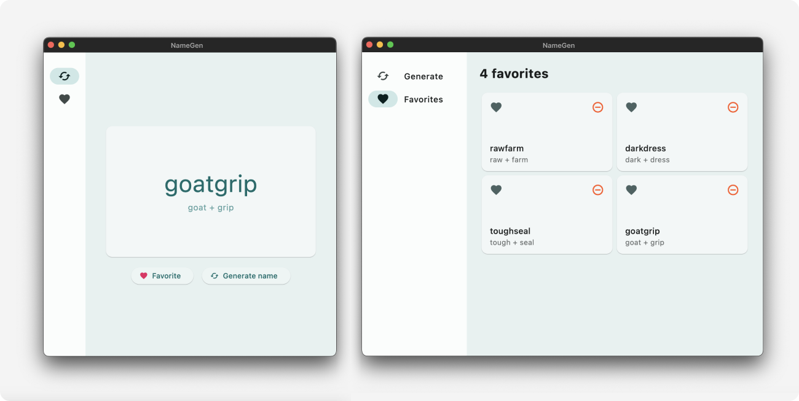

# NameGen

## About

Desktop app to kick off my Flutter studies and learn about basic widgets and other essential constructs.

- Basic responsive layout
- Conditional rendering
- Basic state management
- Material Design styles and widgets

### What it does

It's pretty simple: the app lets you generate new words by combining pairs of English words in a pseudo-random fashion. You can also add or remove words from a favorites list.

 

 

## Extra notes

- This project is purely a practical exercise intended for developing and/or showcasing my skills in the tools/techniques/concepts mentioned above. It's not meant to be a complete production-ready solution. If you have any questions or simply want to chat about it, feel free to reach out!
